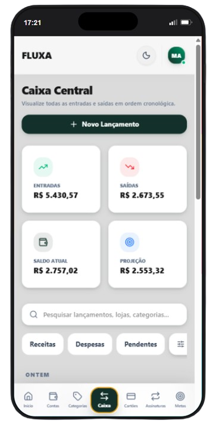
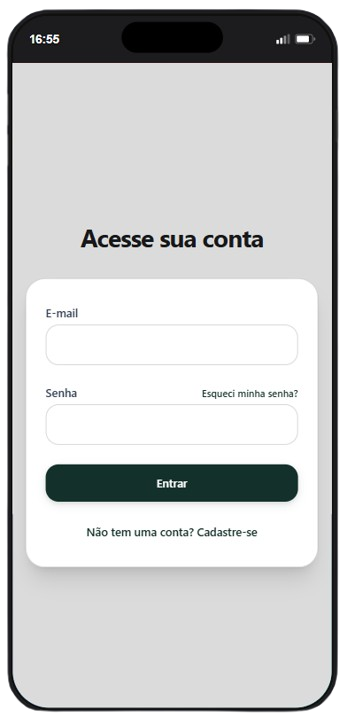
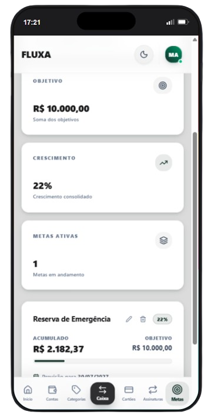

```markdown
# Fluxa

<div align="center">
  
  
  
  
  
</div>

<br>

<div align="center">
  <h3>🚀 <strong>Deploy:</strong> <a href="https://COLOQUE-SEU-LINK-AQUI.com">Acessar a Aplicação ao Vivo</a></h3>
  <p><em>(O sistema permite criação de contas reais ou uso de credenciais de demonstração)</em></p>
</div>

<br>

**Fluxa** é uma aplicação Full Stack de gestão financeira pessoal e patrimonial desenvolvida do zero. O sistema vai muito além de um simples rastreador de despesas, unificando o controle de fluxo de caixa, cartões de crédito, compras parceladas, carteiras de metas e assinaturas recorrentes em uma única plataforma moderna, segura e instalável (PWA).



---

## 🎯 Objetivo do Projeto

O Fluxa nasceu da necessidade de ter uma ferramenta financeira realmente simples, rápida e confiável. Ao longo do desenvolvimento, o projeto evoluiu para servir como um **laboratório de engenharia de software**, focado na aplicação prática de arquitetura limpa, segurança, banco de dados e experiência do usuário (UX).

O projeto foi construído com dois propósitos principais:

- **Demonstrar capacidade técnica:** Construir uma API robusta que domina modelagem relacional complexa, transações ACID, consistência de dados, prevenção contra ataques BOLA/IDOR e cobertura por testes automatizados.
- **Resolver uma necessidade real:** Entregar uma solução financeira diária sem anúncios, adaptada à realidade do controle financeiro, com uma interface responsiva desenhada para atrito zero.

---

## 📸 Demonstração Visual

### Login e Autenticação Segura


### Fluxo de Caixa e Dashboard


### Gestão de Transações


### Controle de Assinaturas


### Carteiras e Metas Financeiras


---

## 🧠 Engenharia e Destaques Técnicos

O Fluxa se diferencia por resolver problemas críticos de software de forma estruturada:

- **Precisão Monetária (Centavos):** Os valores monetários são normalizados e persistidos como números inteiros (centavos) no banco de dados, evitando anomalias de precisão com _floating points_. Algoritmos determinísticos garantem que o arredondamento de dízimas em parcelamentos bata exatamente com o valor original.
- **Controle de Concorrência (ACID):** Operações críticas, como a dedução do limite de um cartão ou aportes em carteiras, são envolvidas em transações SQL isoladas via Knex. Isso previne _race conditions_ em requisições simultâneas.
- **Isolamento de Dados (Ownership):** O backend determina a propriedade dos dados exclusivamente através da identidade criptografada no token JWT (`user_id`). A API não confia em IDs passados via payload, bloqueando vazamentos entre contas.
- **Separação de Domínios (Caixa vs. Crédito):** A arquitetura blinda o dinheiro real (saldo) do dinheiro virtual (limite). Compras no crédito geram obrigações temporais, e o fluxo de caixa só sofre impacto no momento exato do pagamento da fatura.
- **Testes Automatizados (Vitest):** Suíte rigorosa de 31 testes cobrindo resiliência de autenticação, fluxos de dupla checagem (2FA) e integridade matemática financeira.

---

## ✨ Funcionalidades Principais

### 🔐 Segurança e Autenticação

- **JWT & Fail-Fast:** Sessões protegidas por Tokens e payloads sanitizados via Zod antes de atingirem a regra de negócio.
- **Autenticação em Dois Fatores (2FA):** Camada adicional de segurança via TOTP (Authenticator App) e Recovery Codes.
- **Recuperação de Acesso:** Fluxo de redefinição de senha com tokens de e-mail seguros via SMTP (Brevo).

### 💰 Gestão Financeira Completa

- **Fluxo de Caixa:** Gestão de múltiplas contas bancárias, categorias e transações dinâmicas (Pendentes/Concluídas).
- **Cartões e Parcelamentos:** Motor de crédito que projeta faturas futuras organicamente pelo calendário.
- **Assinaturas:** Acompanhamento de serviços recorrentes com aviso de data da próxima cobrança.
- **Carteiras (Wallets):** Organização de liquidez e separação de patrimônio para metas específicas.

### 🎨 Design System e UX

- **Mobile-First & PWA:** Layout responsivo otimizado de 360px a 1920px, instalável nativamente no Android como Progressive Web App (aplicativo standalone).
- **Pine & Sage:** Design System próprio desenhado com Tailwind CSS, oferecendo suporte nativo a _Light_ e _Dark Mode_ com alta legibilidade.
- **Modo Privacidade:** Censura rápida de valores financeiros com contexto global (React Context).
- **Tempo Real:** Mutações otimizadas com TanStack Query (React Query) para respostas imediatas da interface.

---

## 🛠️ Stack Tecnológica

A arquitetura Cliente-Servidor foi desenvolvida mantendo as frentes desacopladas, limpas e com responsabilidades bem definidas.

### Frontend

- **Core:** React, TypeScript, Vite, PWA.
- **Estilização:** Tailwind CSS, Lucide React.
- **Gestão de Estado & Assincronicidade:** TanStack Query (React Query).
- **Formulários:** React Hook Form + Zod.

### Backend

- **Core:** Node.js, Fastify, TypeScript.
- **Banco de Dados:** PostgreSQL (Produção) e SQLite (Ambiente Local/Dev).
- **Query Builder & Migrations:** Knex.js.
- **Segurança:** Zod, JWT, Bcrypt, Fastify Rate Limit, Helmet.
- **Testes:** Vitest.

### Infraestrutura

- **Deploy:** Vercel (Frontend) & Render (Backend).
- **E-mails Transacionais:** Brevo SMTP + Nodemailer.
- **Contêineres:** Docker & Docker Compose (Ambiente Local).

---

## 🚀 Como Executar Localmente (Quick Start)

O ambiente de desenvolvimento local foi configurado para ser executado de maneira simples utilizando o **SQLite** como banco de dados padrão, evitando a necessidade imediata de containers pesados no seu primeiro teste.

**Pré-requisitos:** Node.js (v18+) instalado.

**1. Clone o repositório:**

```bash
git clone [https://github.com/matssgit/fluxa.git](https://github.com/matssgit/fluxa.git)
cd fluxa

```

**2. Configure e inicie o Backend:**

```bash
cd backend

# Instale as dependências
npm install

# Crie e configure o arquivo de ambiente
cp .env.example .env
# IMPORTANTE: Abra o arquivo .env e preencha a variável JWT_SECRET com um hash seguro.

# Execute as migrations (criação do banco SQLite local)
npm run knex -- migrate:latest

# Inicie o servidor da API (rodará em http://localhost:3333)
npm run dev

```

**3. Configure e inicie o Frontend:**
Em um novo terminal, retorne para a pasta raiz e acesse o frontend:

```bash
cd frontend

# Instale as dependências
npm install

# Inicie o servidor de desenvolvimento
npm run dev

```

Acesse `http://localhost:5173` no seu navegador para utilizar a aplicação.

---

## 📚 Documentação Técnica

O Fluxa conta com documentação técnica detalhada. Para compreender a fundo as decisões de design, modelagem de banco e planejamento, consulte a pasta `docs/` do repositório:

* 🏛️ [Arquitetura do Sistema](https://www.google.com/search?q=./docs/architecture/SYSTEM_ARCHITECTURE.md)
* 🎨 [Design System](https://www.google.com/search?q=./docs/architecture/DESIGN_SYSTEM.md)
* ⚙️ [Roadmap do Backend](https://www.google.com/search?q=./docs/development/BACKEND_ROADMAP.md)
* 💻 [Roadmap do Frontend](https://www.google.com/search?q=./docs/development/FRONTEND_ROADMAP.md)

---

## 👨‍💻 Desenvolvedor

O Fluxa coroa meu esforço de consolidação técnica em Engenharia de Software. Este projeto une a entrega de uma experiência visual amigável (Front-end) com o desenvolvimento de um back-end sólido, seguro, testado e escalável.

**Matheus Santana**

*Desenvolvedor Full Stack*

* 🐙 **GitHub:** [@matssgit](https://www.google.com/search?q=https://github.com/matssgit)
* 💼 **LinkedIn:** [Matheus Santana](https://www.google.com/search?q=https://linkedin.com/in/matheussantanadev)

```

```