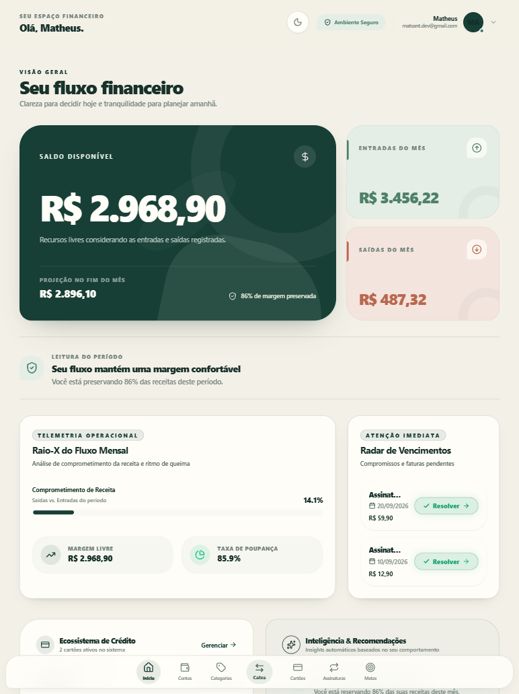
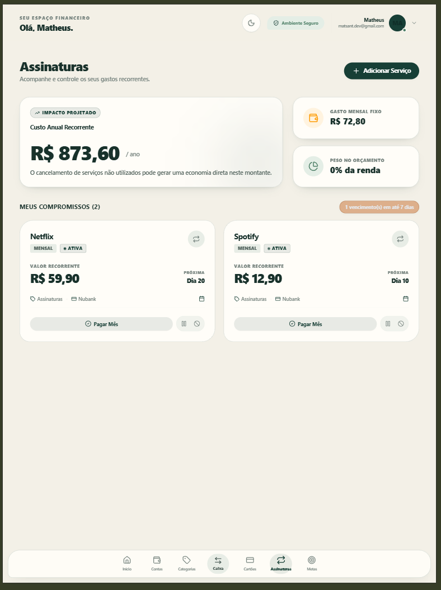
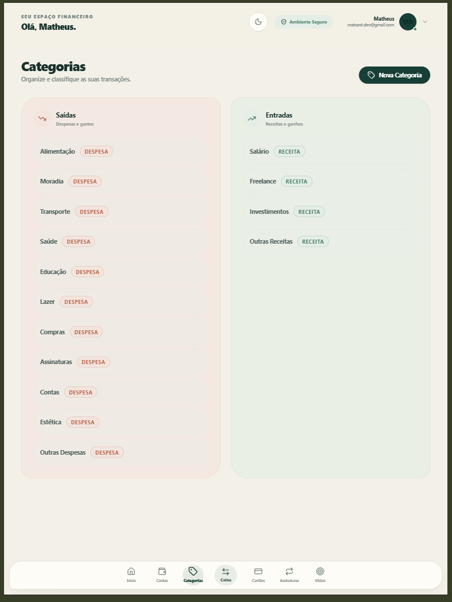

<h1 align="center">Fluxa 💸</h1>

  <strong>Gestão financeira pessoal com visão clara do seu dinheiro, segurança e controle em um só lugar.</strong>

  Fluxo de caixa, cartões, assinaturas e metas reunidos em uma experiência simples para o dia a dia.

  
  
  
  

  <a href="https://fluxa-core-app-five.vercel.app/"><strong>Aplicação online</strong></a>
  &nbsp;·&nbsp;
  <a href="https://matheusantanadev.vercel.app/">Portfólio</a>
  &nbsp;·&nbsp;
  <a href="https://github.com/matssgit/fluxa-app">GitHub</a>

## 📸 Preview

### Dashboard

  

<table>
  <tr>
    <td align="center"><strong>Caixa Central</strong></td>
    <td align="center"><strong>Cartões</strong></td>
  </tr>
  <tr>
    <td width="50%"></td>
    <td width="50%"></td>
  </tr>
  <tr>
    <td align="center"><strong>Assinaturas</strong></td>
    <td align="center"><strong>Metas</strong></td>
  </tr>
  <tr>
    <td width="50%"></td>
    <td width="50%"></td>
  </tr>
  <tr>
    <td align="center"><strong>Categorias</strong></td>
    <td align="center"><strong>Segurança e 2FA</strong></td>
  </tr>
  <tr>
    <td width="50%"></td>
    <td width="50%"></td>
  </tr>
  <tr>
    <td align="center"><strong>Login</strong></td>
    <td align="center"><strong>Cadastro e verificação</strong></td>
  </tr>
  <tr>
    <td width="50%"></td>
    <td width="50%"></td>
  </tr>
</table>

## 🌱 Sobre o Fluxa

O Fluxa começou como um estudo de CRUD financeiro. Conforme novos domínios foram adicionados, o projeto evoluiu para uma aplicação full stack voltada a problemas que aparecem no uso real: consistência de saldos, operações simultâneas, sessões seguras e uma interface que continue clara com o crescimento dos dados.

Caixa, crédito, recorrência e objetivos têm regras próprias, mas convergem em uma leitura única no dashboard. Essa evolução tornou o Fluxa um exercício prático de engenharia de produto, além do CRUD que deu origem ao projeto.

## ✨ Funcionalidades

### 💰 Finanças

- receitas, despesas, contas e saldos;
- histórico centralizado no Caixa Central;
- categorias e lançamentos pendentes;
- dashboard com visão consolidada e projeções.

### 💳 Cartões

- limite total e disponível;
- compras à vista ou parceladas;
- vencimentos e pagamentos;
- cancelamentos com recomposição do limite.

### 🔄 Assinaturas

- gastos recorrentes e próximos vencimentos;
- pagamentos por competência mensal;
- proteção contra pagamentos duplicados.

### 🎯 Metas

- metas e objetivos em wallets;
- depósitos e retiradas;
- histórico e acompanhamento de progresso.

### 🔐 Segurança

- autenticação JWT e confirmação de e-mail;
- recuperação de senha com token de uso único;
- revogação de sessão por versão do token;
- 2FA via TOTP e recovery codes;
- isolamento de dados e cache entre usuários.

### 📱 Experiência

- interface responsiva e temas claro/escuro;
- modo de privacidade;
- PWA instalável;
- navegação própria para mobile e desktop.

## 🧠 Destaques técnicos

- **Integridade financeira:** valores usam magnitude não negativa e <code>type</code> define entrada ou saída, evitando semântica ambígua pelo sinal.
- **Compatibilidade legada:** o fallback pelo sinal fica restrito a registros antigos sem tipo; novos lançamentos sempre seguem o modelo canônico.
- **Concorrência financeira:** cartões, parcelas, cancelamentos e wallets usam transações e locks para impedir lost updates, cobrança dupla e restauração duplicada de limite.
- **Assinaturas idempotentes:** a competência mensal identifica o pagamento e impede duplicidade.
- **Sessões revogáveis:** <code>token_version</code> invalida JWTs anteriores depois de alterações sensíveis.
- **Reset e 2FA:** tokens de redefinição são armazenados como hash SHA-256 e consumidos uma vez; TOTP e recovery codes adicionam uma segunda camada de acesso.
- **Ownership:** toda consulta protegida considera o usuário autenticado, reduzindo risco de acesso cruzado por ID.
- **Isolamento de cache:** QueryClient e dados locais são limpos na troca ou invalidação de sessão.
- **Defesa HTTP:** Zod valida entradas, rate limiting reduz abuso e Helmet aplica headers de segurança.
- **Schema versionado:** PostgreSQL é o banco oficial e o Knex mantém migrations ordenadas e reversíveis.
- **Regressão automatizada:** testes exercitam autenticação, concorrência e cálculos contra um PostgreSQL dedicado.

## 🏗️ Arquitetura

~~~text
React + TypeScript + Vite       Vercel
             │
             │ HTTPS / JSON
             ▼
Fastify + TypeScript + Zod      Render
             │
             │ Knex
             ▼
         PostgreSQL
~~~

## 🧰 Stack

| Camada | Tecnologias principais |
| --- | --- |
| Frontend | React, TypeScript, Vite, Tailwind CSS, TanStack Query |
| Backend | Node.js, Fastify, TypeScript, Zod, Knex |
| Banco | PostgreSQL |
| Autenticação | JWT, bcrypt, TOTP |
| Testes | Vitest e test runner nativo do Node.js |
| Infraestrutura | Vercel, Render, Docker Compose, Brevo SMTP |

## ✅ Qualidade e testes

O projeto possui **65 testes automatizados passando**:

- **64 testes backend** com Vitest;
- **1 teste frontend** para a atualização consistente do histórico financeiro.

A cobertura inclui autenticação, 2FA, revogação de sessão, ownership, hardening, integridade financeira, concorrência, cartões, assinaturas, wallets e histórico do caixa.

Comandos principais:

~~~bash
# Backend
cd backend
npm test -- --run

# Frontend
cd frontend
npm test
npm run lint
npm run build
~~~

## 📲 PWA

O Fluxa pode ser instalado como Progressive Web App. O frontend gera manifest e service worker durante o build, inclui ícones dedicados e oferece uma experiência adequada para dispositivos móveis.

Dados financeiros autenticados não usam runtime caching no service worker, evitando que respostas privadas sejam reutilizadas indevidamente.

## 🚀 Rodando localmente

### Requisitos

- Node.js 18 ou superior;
- npm;
- PostgreSQL 16 ou compatível;
- Docker e Docker Compose, caso prefira usar o banco disponibilizado pelo projeto.

### Instalação

~~~bash
git clone https://github.com/matssgit/fluxa-app.git
cd fluxa-app

cd backend
npm install

cd ../frontend
npm install
~~~

### Backend

1. Inicie uma instância PostgreSQL. O projeto inclui [docker-compose.yml](./backend/docker-compose.yml).
2. Crie <code>backend/.env</code> com as variáveis necessárias e uma <code>DATABASE_URL</code> apontando para o banco local.
3. Aplique as migrations e inicie a API:

~~~bash
cd backend
docker compose up -d
npm run migrate:latest
npm run dev
~~~

A API utiliza a porta <code>3333</code> por padrão.

### Frontend

Crie <code>frontend/.env.local</code> com <code>VITE_API_URL</code> apontando para a API local e execute:

~~~bash
cd frontend
npm run dev
~~~

O Vite utiliza a porta <code>5173</code> por padrão.

### Variáveis de ambiente

Backend:

~~~text
DATABASE_URL
DATABASE_CLIENT
JWT_SECRET
FRONTEND_URL
CORS_ORIGIN
SMTP_HOST
SMTP_PORT
SMTP_USER
SMTP_PASSWORD
EMAIL_FROM
DEMO_CLEANUP_ENABLED
DEMO_DATA_RETENTION_DAYS
~~~

Frontend:

~~~text
VITE_API_URL
~~~

Nenhum secret deve ser versionado. A limpeza automática de contas demo permanece desativada por padrão e deve ser habilitada somente de forma deliberada.

## 📚 Documentação

- [Arquitetura do sistema](./docs/architecture/SYSTEM_ARCHITECTURE.md)
- [Design system](./docs/architecture/DESIGN_SYSTEM.md)
- [Checklist de QA](./docs/development/QA_CHECKLIST.md)
- [Histórico de sprints](./docs/development/SPRINTS.md)

## 📌 Status

**Projeto ativo — versão estável de portfólio.**

Uma versão demo pública está disponível em [fluxa-core-app-five.vercel.app](https://fluxa-core-app-five.vercel.app/).

## 👤 Autor

**Matheus Santana**

- [Portfólio](https://matheusantanadev.vercel.app/)
- [GitHub](https://github.com/matssgit)
- [LinkedIn](https://linkedin.com/in/matheussantanadev)
